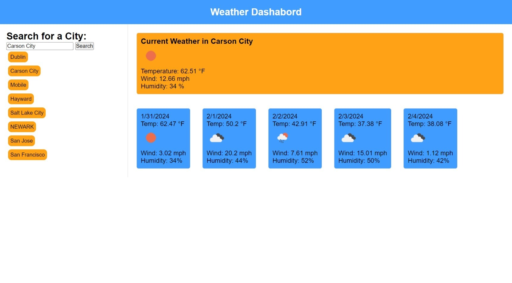

# Weather-Dashboard
### A simple Weather Web App for users

## Overview

Weather Dashboard is a web application that allows users to search for current weather conditions and forecasts for different cities. It fetches data from the OpenWeather API and displays current weather information as well as a 5-day forecast.

## Features

- Search for a city to get current weather conditions and a 5-day forecast.
- Display of temperature, wind speed, humidity, and weather conditions with icons.
- Saving of search history for quick re-access to previously searched cities.
- Responsive design for both desktop and mobile devices.

## How to Use

1. **Search for a City**: Enter a city name in the search bar and click the 'Search' button.
2. **View Current Weather**: The current weather for the city will be displayed including temperature, wind speed, and humidity.
3. **View Forecast**: A 5-day forecast is also shown, providing weather conditions for the upcoming days.
4. **Access Search History**: Click on a city in the search history to quickly view weather information for that city again.

#### Link to Website:
[Weather-Dashboard](https://robertsolorzano.github.io/Weather-Dashboard/)

## Installation

To use Weather Dashboard, simply clone the repository and open `index.html` in a web browser.

## Tech Stack
- HTML
- CSS
- JavaScript
- OpenWeather API

## License
This project is licensed under the MIT License.

## Credits
- OpenWeather for providing the weather data API